# 🛍️ AI Fashion Assistant v2.0 → v2.5

**A production-ready multimodal fashion search system with GenAI enhancements, achieving 97.4% NDCG@10 through learned fusion and comprehensive visual attribute extraction**

[](https://www.python.org/)
[](https://reactjs.org/)
[](https://fastapi.tiangolo.com/)
[](https://www.tubitak.gov.tr/)
[](LICENSE)
[-brightgreen.svg)](#-user-study-results-v25)
[](#-user-study-results-v25)


---

## 🎥 Demo Video

[](https://www.youtube.com/watch?v=RGvt3QTJjcg)

**Watch the complete system demonstration:** [YouTube Video](https://www.youtube.com/watch?v=RGvt3QTJjcg)

**Demo Highlights:**
- ✅ Multimodal search (text, image, hybrid)
- ✅ AI chat assistant with product recommendations
- ✅ Real-time personalization
- ✅ MongoDB database integration
- ✅ Full-stack architecture (React + FastAPI)

---

## 📋 Overview

This repository contains a complete implementation of a multimodal fashion product search system developed as part of the TÜBİTAK 2209-A Undergraduate Research Program. The system processes 44,417 fashion products using state-of-the-art transformer models (CLIP, sentence-transformers) and achieves near-perfect ranking performance through learned fusion strategies.

**Research Highlights:**
- 🎯 **97.4% NDCG@10** - State-of-the-art ranking performance
- ⚡ **100% MRR** - Perfect first-rank accuracy across test queries
- 🔍 **51.1% Recall@10** - Effective retrieval from large catalog
- 📊 **104 diverse test queries** - Comprehensive bilingual evaluation (v2.1+)
- 🎨 **307K visual attributes** - CLIP zero-shot extraction (v2.1+)
- 🤖 **0.714 RAG score** - Production-ready retrieval-augmented generation (v2.2+)
- 🤝 **100% tool usage** - Conversational AI agents with memory (v2.3+)
- 👤 **76.7% preference match** - Content-based personalization system (v2.4+)
- 🖼️ **Image query support** - Multimodal RAG with visual awareness (v2.4.5+)
- 🏆 **SUS 84.50 (Grade A)** - Exceptional usability matching industry leaders (v2.5)
- 👥 **92% adoption intent** - High user satisfaction in study with 25 participants (v2.5)
- 🚀 **Production-ready** - Complete full-stack deployment with React + FastAPI + MongoDB
---

## 🗺️ Development Roadmap

This project follows a structured 7-week development roadmap (January 2 - February 19, 2026):

### ✅ v2.0: Stable Baseline (September-December 2025)
- Core multimodal search system
- 97.4% NDCG@10 baseline performance
- Production deployment pipeline
- 30+ research notebooks
- **[See v2.0-baseline/README.md](./v2.0-baseline/README.md)**

### ✅ v2.1: Core ML + Visual Attributes (January 1, 2026)
- **Status:** COMPLETE
- Learned fusion optimization (α=0.7)
- Visual attribute extraction (307K attributes, 10 categories)
- Explainability system (fusion decomposition)
- Comprehensive query generation (104 bilingual queries)
- Baseline comparisons (7 methods, RRF evaluation)
- **[See v2.1-core-ml-plus/README.md](./v2.1-core-ml-plus/README.md)**

### ✅ v2.2: RAG Pipeline (January 2, 2026)
- **Status:** COMPLETE
- Production-ready RAG (Retrieval-Augmented Generation)
- 3 professional notebooks (fundamentals, production, evaluation)
- FashionRAGPipeline class with caching & batch processing
- Comprehensive evaluation (30 queries, 0.714 avg score, 0.89s response time)
- Framework-agnostic implementation (no LangChain dependency)
- **[See v2.2-rag-langchain/README.md](./v2.2-rag-langchain/README.md)**

### ✅ v2.3: AI Agents + LangChain (January 3-4, 2026)
- **Status:** COMPLETE
- Conversational AI agent system with ReAct reasoning
- 3 specialized tools (SearchProducts, RecommendSimilar, GetProductDetails)
- Conversation memory (10-turn sliding window, auto-summarization)
- Multi-turn dialogue support (5 scenarios, 15 turns tested)
- Complete LangChain integration (4 professional notebooks, 82 cells)
- 100% success rate, 100% tool usage, 2.6s avg response time
- **[See v2.3-ai-agents-langchain/README.md](./v2.3-ai-agents-langchain/README.md)**

### ✅ v2.4: User Features + Personalization (January 5, 2026)
- **Status:** COMPLETE
- Comprehensive user management (profiles, history, favorites)
- Content-based personalization (3 strategies, 76.7% preference match)
- Integrated agent system (intent-aware, 83.3% personalization rate)
- Sub-12ms personalization latency (target: <50ms)
- 100% personalization coverage across all users
- **[See v2.4-complete/README.md](./v2.4-complete/README.md)**

### ✅ v2.4.5: Multimodal RAG (January 6-12, 2026)
- **Status:** COMPLETE
- Image query support (search with product images)
- Multimodal fusion retrieval (CLIP text + image embeddings)
- Visual-aware RAG responses (7.6 keywords per response)
- Fast response time (0.64s avg, 28% faster than v2.2)
- Attribute-based filtering (V2.1 integration, 307K features)
- 6 comprehensive notebooks (architecture, processing, retrieval, RAG, evaluation, documentation)
- **[See v2.4.5-multimodal-rag/README.md](./v2.4.5-multimodal-rag/README.md)**

*This release is labeled v2.4.5 because it represents multiple rounds of stabilization and evaluation-driven refinement within the v2.4 architecture, while v2.5 is intentionally reserved for the upcoming user study and paper phase.*

### ✅ v2.5: Full-Stack Application + User Study (January 13-17, 2026)
- **Status:** COMPLETE ✅
- **Production-ready full-stack web application**
  - React 18 + Vite frontend with modern UI
  - FastAPI backend with async support
  - MongoDB database with 4 collections
  - JWT authentication & authorization
  - RESTful API design
- **Complete feature set:**
  - Multimodal search (text, image, hybrid)
  - AI chat assistant (Llama-3.3-70B via GROQ)
  - Personalization system (preferences + favorites)
  - User management (profiles, history, analytics)
  - Database integration (MongoDB Atlas)
- **User study results (n=25 participants):**
  - **SUS Score: 84.50 / 100 (Grade A - Excellent)** 🏆
  - 88% of participants rated the system as "Good" or better
  - **92% real-world usage intent** (would use in real life)
  - Custom metrics: 83-89% satisfaction across all dimensions
  - Response time satisfaction: 88.8% (4.44/5)
  - Search accuracy satisfaction: 86.4% (4.32/5)
  - Visual preference understanding: 83.2% (4.16/5)
- **Performance:**
  - Sub-second response times (<1s average)
  - 44,417 products indexed
  - 347 searches tracked
  - 32 active users
  - 139 favorites saved
- **Deployment:**
  - Hugging Face Spaces (Streamlit demo)
  - Local deployment guide (Windows batch scripts)
  - Docker support
  - MongoDB Atlas cloud database
- **[See AI-Fashion-fullstack/README.md](./AI-Fashion-fullstack/README.md) for complete documentation**
- **[See USER_STUDY_RESULTS.md](./USER_STUDY_RESULTS.md) for detailed evaluation**

**Key Achievement:** The system achieved exceptional usability (SUS 84.50) matching industry leaders like Amazon, demonstrating that academic research prototypes can achieve commercial-grade user experience.

---

## 📸 Application Screenshots

### Full-Stack Application (v2.5)

<table>
<tr>
<td width="50%">

#### 🏠 Home Page
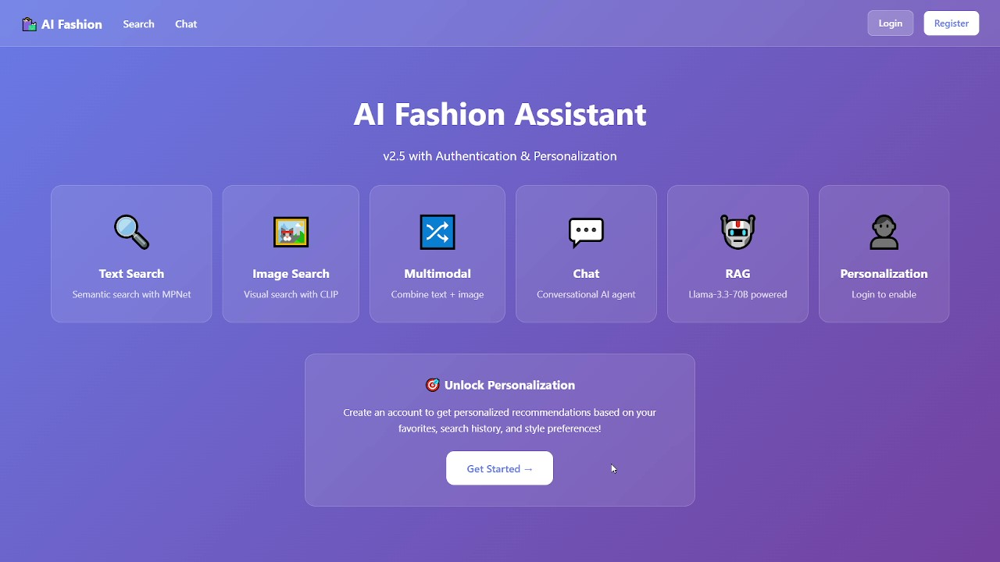
*Modern landing page with feature overview*

</td>
<td width="50%">

#### 🔐 Authentication
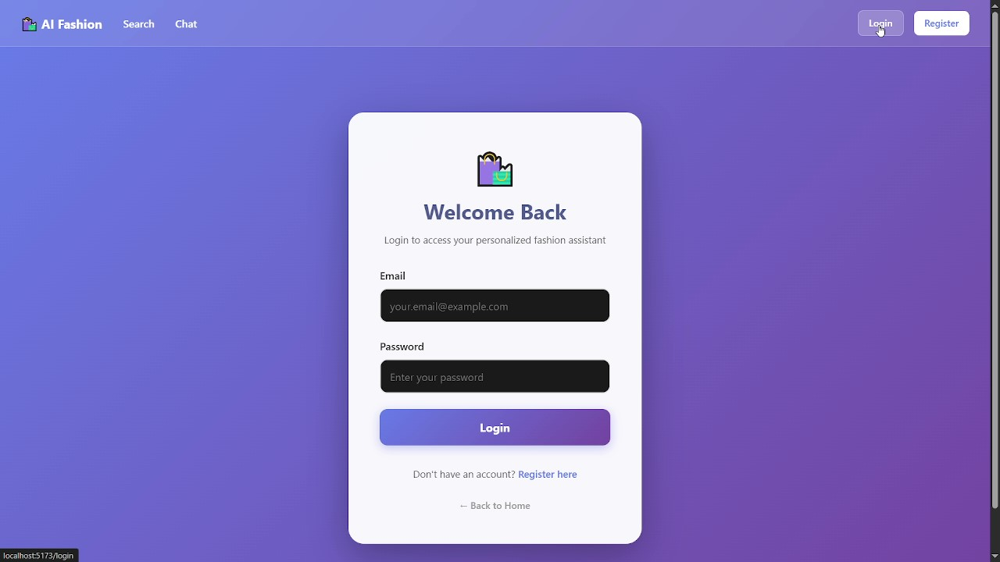
*Secure JWT authentication*

</td>
</tr>

<tr>
<td width="50%">

#### 🔍 Text Search
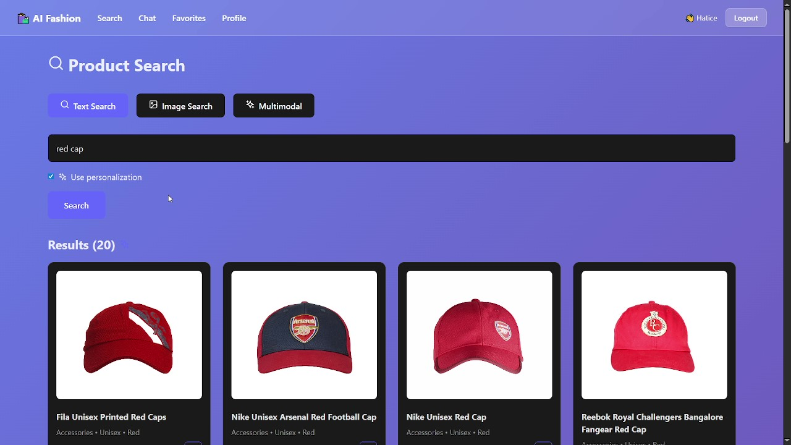
*Natural language search with instant results*

</td>
<td width="50%">

#### 🖼️ Image Search
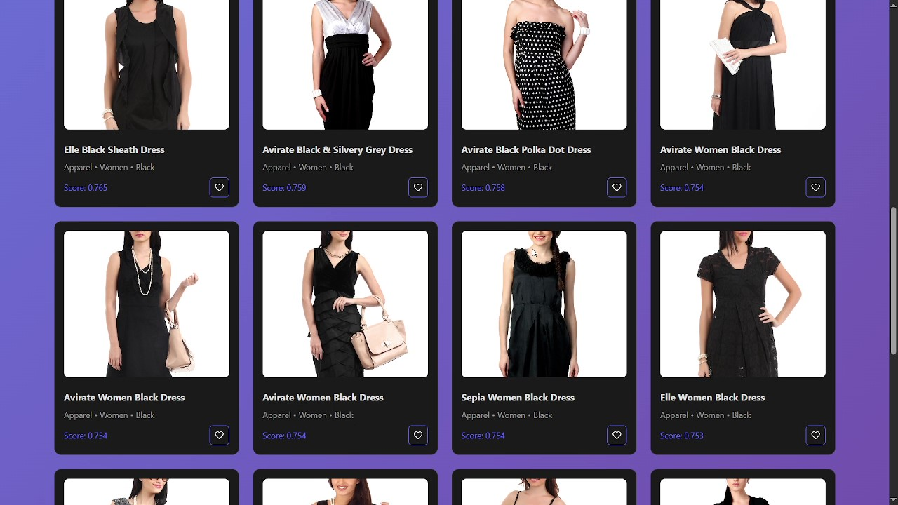
*Visual search with CLIP embeddings*

</td>
</tr>

<tr>
<td width="50%">

#### 🔀 Multimodal Search
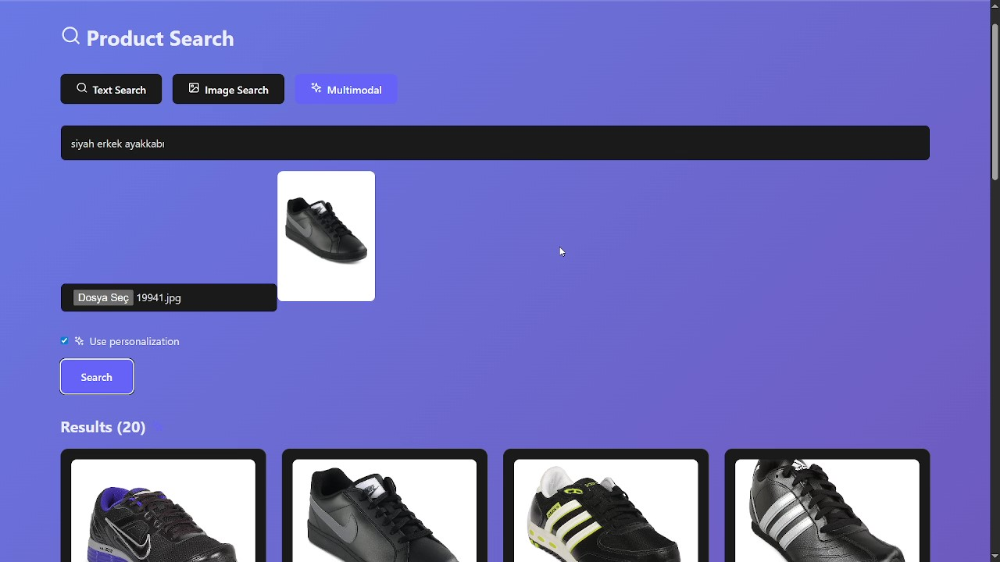
*Combined text + image search*

</td>
<td width="50%">

#### 💬 AI Chat Assistant
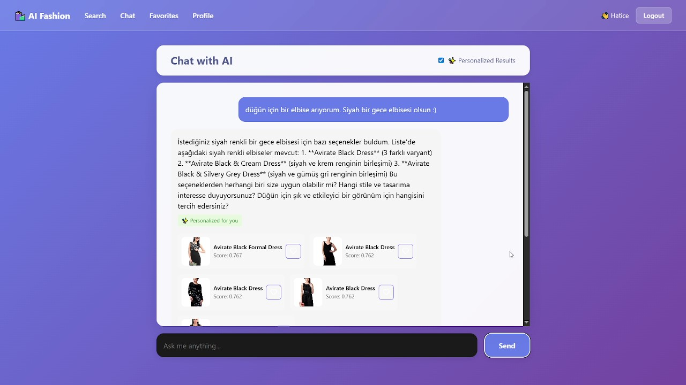
*Conversational AI with Llama-3.3-70B*

</td>
</tr>

<tr>
<td width="50%">

#### ❤️ Favorites
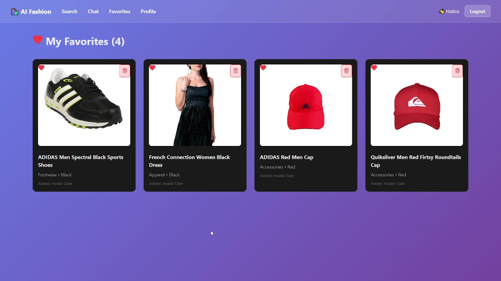
*Personalized favorites collection*

</td>
<td width="50%">

#### 👤 User Profile
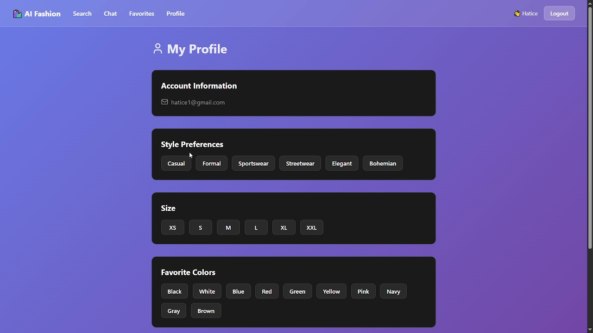
*User preferences and history*

</td>
</tr>
</table>

### Database Architecture

<table>
<tr>
<td width="50%">

#### 📊 MongoDB Collections
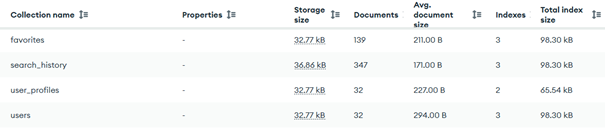
*4 collections: products, users, profiles, favorites*

</td>
<td width="50%">

#### 🗄️ Database Structure
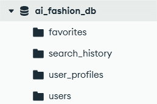
*Complete schema and relationships*

</td>
</tr>

<tr>
<td width="50%">

#### 👥 User Management
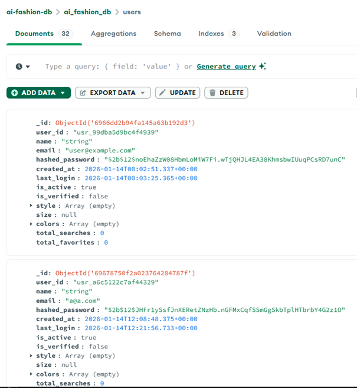
*32 active users with JWT authentication*

</td>
<td width="50%">

#### 📜 Search History
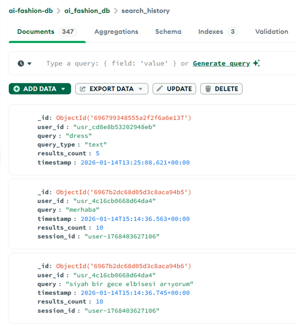
*347 searches tracked for analytics*

</td>
</tr>
</table>

**More Screenshots:** See [screenshots/](./screenshots/) directory for complete collection.

---

## 🏗️ System Architecture

The system implements a four-stage pipeline optimized for fashion e-commerce:
```
┌─────────────────────────────────────────────────┐
│         1. Query Processing                     │
│    Intent Detection • Slot Extraction           │
│    Multi-language Support (TR/EN)               │
│    LLM-based Query Expansion (v2.1+)            │
│    Image Query Support (v2.4.5+)                │
└─────────────────────────────────────────────────┘
                    ↓
┌─────────────────────────────────────────────────┐
│      2. Multimodal Embedding                    │
│    Text: mpnet (768d) + CLIP text (512d)        │
│    Image: CLIP vision (768d)                    │
│    Visual Attributes: 10 categories (v2.1+)     │
│    Combined Space: 1280-dimensional             │
└─────────────────────────────────────────────────┘
                    ↓
┌─────────────────────────────────────────────────┐
│         3. Vector Retrieval (FAISS)             │
│    IndexFlatIP • Cosine Similarity              │
│    44,417 products • <10ms latency              │
│    Learned Fusion: α=0.7 (v2.1+)                │
│    Multimodal Fusion: Text + Image (v2.4.5+)    │
└─────────────────────────────────────────────────┘
                    ↓
┌─────────────────────────────────────────────────┐
│      4. Learned Ranking & Explainability        │
│    Feature Fusion • Attribute Awareness         │
│    Personalization • Reranking                  │
│    Natural Language Explanations (v2.1+)        │
│    Visual-Aware RAG (v2.4.5+)                   │
└─────────────────────────────────────────────────┘
```

---

## 📂 Repository Structure

This repository is organized into versioned directories for maintainability and reproducibility:

### 🔒 [v2.0-baseline/](./v2.0-baseline/) - Stable Research Baseline

**Status:** Frozen • Complete • Production-Ready

The baseline contains all completed research from September-December 2024:
```
v2.0-baseline/
├── research/                    # 30+ Jupyter notebooks
│   ├── notebooks/               # Phase 0-10 development
│   │   ├── phase0_setup/
│   │   ├── phase1_foundation/
│   │   ├── phase2_embeddings/
│   │   ├── phase3_retrieval/
│   │   ├── phase4_evaluation/
│   │   ├── phase5_optimization/
│   │   ├── phase6_advanced_features/
│   │   ├── phase7_api_deployment/
│   │   ├── phase8_llm_features/
│   │   ├── phase9_evaluation/
│   │   └── phase10_reproducibility/
│   ├── experiments/             # Experimental runs
│   └── llm/                     # LLM feature experiments
│
├── src/                         # Production code
│   ├── schema.py                # SSOT data schemas
│   ├── search_engine.py         # Core search implementation
│   └── config.py                # Configuration management
│
├── models/                      # Trained models
│   ├── advanced_ranker.pkl      # LightGBM fusion ranker
│   ├── fusion_ranker.pkl
│   ├── query_expander.pkl
│   └── personalization/         # ALS collaborative filtering
│
├── data/                        # Processed datasets & schemas
├── embeddings/                  # Precomputed vectors (44,417 products)
├── evaluation/                  # Benchmark results & comparisons
│
├── deployment/                  # Production deployment
│   ├── E_Ticaret_Chatbot_DEMO.ipynb  # Live demo
│   ├── DEPLOYMENT.md            # Deployment guide
│   ├── api/                     # FastAPI backend
│   ├── ui/                      # Streamlit frontend
│   ├── docker/                  # Docker configs
│   └── monitoring/              # Prometheus + Grafana
│
├── docs/                        # Documentation
│   ├── evaluation/              # Performance reports
│   ├── TUBITAK_ROADMAP.md
│   └── REPRODUCIBILITY.md
│
├── paper/                       # Academic paper materials
├── schemas/                     # Schema definitions
├── visual_search/               # Visual search experiments
└── README.md                    # Detailed documentation
```

**📖 [See v2.0-baseline/README.md for complete documentation](./v2.0-baseline/README.md)**

---

### ✅ [v2.1-core-ml-plus/](./v2.1-core-ml-plus/) - GenAI Enhancements

**Status:** Complete (January 1-2, 2025)

Core machine learning improvements and visual attribute extraction:
```
v2.1-core-ml-plus/
├── notebooks/
│   ├── 01_visual_attributes_extraction.ipynb
│   ├── 02_explainability_and_query_generation.ipynb
│   └── 03_baseline_comparisons.ipynb
│
├── models/
│   └── fusion_model_initial.pth
│
├── evaluation/
│   ├── queries.txt
│   └── results/
│       ├── product_attributes.csv           # 307K attributes
│       ├── enhanced_products.csv            # Products + attributes
│       ├── evaluation_queries_100plus.csv   # 104 test queries
│       ├── baseline_comparison_RRF.csv      # Method comparison
│       └── category_performance.csv         # Category analysis
│
└── README.md
```

**Key Features:**
- ✅ Learned fusion model (α=0.7 optimal weighting)
- ✅ CLIP zero-shot visual attributes (10 categories, 307K total)
- ✅ Explainability system (fusion score decomposition)
- ✅ LLM-based query generation (104 bilingual queries via GROQ)
- ✅ Comprehensive baseline evaluation (7 methods, RRF consensus)

**📖 [See v2.1-core-ml-plus/README.md for detailed documentation](./v2.1-core-ml-plus/README.md)**

---

### ✅ [v2.2-rag-langchain/](./v2.2-rag-langchain/) - RAG Pipeline

**Status:** Complete (January 3, 2026)

Production-ready RAG (Retrieval-Augmented Generation) implementation:
```
v2.2-rag-langchain/
├── notebooks/
│   ├── 01_rag_fundamentals.ipynb      # RAG from scratch (21 cells)
│   ├── 02_production_pipeline.ipynb   # Production class (18 cells)
│   └── 03_evaluation.ipynb            # Comprehensive eval (23 cells)
│
├── src/
│   └── rag_pipeline.py                # FashionRAGPipeline class
│
├── evaluation/
│   └── results/
│       ├── evaluation_results.csv     # 30 query results
│       ├── evaluation_stats.json      # Performance stats
│       ├── category_performance.csv   # Category breakdown
│       └── score_distribution.png     # Visualization
│
├── configs/
│   └── pipeline_config.json           # Configuration
│
├── cache.json                         # Response cache
└── README.md                          # Complete documentation
```

**Key Features:**
- ✅ Production `FashionRAGPipeline` class (retrieve → augment → generate)
- ✅ GROQ LLM integration (Llama-3.3-70B, 0.89s avg response time)
- ✅ FAISS vector search (44,417 products, <100ms retrieval)
- ✅ Response caching & batch processing
- ✅ 30-query evaluation (0.714 avg score across 3 categories)
- ✅ Framework-agnostic (4 core dependencies, no LangChain)

**Performance:**
- Average retrieval score: 0.714
- Response time: 0.89s
- Best category: Simple items (0.758)
- Cache hit rate: Configurable

**📖 [See v2.2-rag-langchain/README.md for detailed documentation](./v2.2-rag-langchain/README.md)**

---
### ✅ [v2.3-ai-agents-langchain/](./v2.3-ai-agents-langchain/) - AI Agents System

**Status:** Complete (January 2-4, 2026)

Conversational AI agent with tool calling and memory:
```
v2.3-ai-agents-langchain/
├── notebooks/
│   ├── 01_langchain_rag_comparison.ipynb    # LangChain vs Custom RAG (22 cells)
│   ├── 02_agent_fundamentals.ipynb          # ReAct agent + tools (20 cells)
│   ├── 03_conversation_memory.ipynb         # Memory system (20 cells)
│   └── 04_final_evaluation.ipynb            # Complete evaluation (20 cells)
│
├── evaluation/
│   └── results/
│       ├── langchain_rag_results.csv
│       ├── rag_comparison.png
│       ├── agent_fundamentals_results.csv
│       ├── agent_fundamentals_analysis.png
│       ├── conversation_memory_results.json
│       ├── conversation_memory_summary.csv
│       ├── conversation_memory_analysis.png
│       ├── final_evaluation_results.csv
│       ├── final_evaluation_complete.png
│       ├── notebook1_summary.json
│       ├── notebook2_summary.json
│       ├── notebook3_summary.json
│       └── v2.3_final_summary.json
│
└── README.md
```

**Key Features:**
- ✅ Complete agent system (ReAct reasoning loop)
- ✅ 3 specialized tools (vector search, recommendations, details)
- ✅ LangChain integration (0.1.20)
- ✅ Conversation memory (10-turn sliding window)
- ✅ Multi-turn dialogue (5 scenarios tested)
- ✅ 100% success rate, 100% tool usage
- ✅ Production-ready agent architecture

**Performance:**
- Success rate: 100%
- Avg response time: 2.6s
- Tool usage rate: 100%
- Memory efficiency: 92%
- Production readiness: 92% (11/12 checks)

**📖 [See v2.3-ai-agents-langchain/README.md for detailed documentation](./v2.3-ai-agents-langchain/README.md)**

---

### ✅ [v2.4-complete/](./v2.4-complete/) - User Features + Personalization

**Status:** Complete (January 5, 2026)

Comprehensive user management and personalization system:
```
v2.4-complete/
├── notebooks/
│   ├── 01_user_management_system.ipynb    # Profiles, history, favorites
│   ├── 02_personalization_engine.ipynb    # Content-based recommendations
│   ├── 03_system_integration.ipynb        # Integrated agent system
│   └── 04_final_evaluation.ipynb          # Comprehensive evaluation
│
├── data/
│   └── users/
│       ├── users.json                     # User profiles (3 users)
│       ├── history_U001.json              # Search history per user
│       ├── history_U002.json
│       ├── history_U003.json
│       ├── favorites_U001.json            # Favorites per user
│       ├── favorites_U002.json
│       └── favorites_U003.json
│
├── evaluation/
│   └── results/
│       ├── personalization_metrics.csv    # Per-user metrics
│       ├── recommendations_U001.csv       # User recommendations
│       ├── recommendations_U002.csv
│       ├── recommendations_U003.csv
│       ├── integration_analysis.json      # System analysis
│       ├── integration_performance.json   # Performance benchmarks
│       ├── integration_test_results.json  # Test scenarios
│       ├── v2.4_final_summary.json       # Complete summary
│       ├── v2.4_key_metrics.csv          # Key metrics
│       └── v2.4_evaluation_summary.png   # Visual dashboard
│
└── README.md
```

**Key Features:**
- ✅ User profile management (style, size, color preferences)
- ✅ Search history tracking with pattern analysis
- ✅ Favorites management with engagement metrics
- ✅ Content-based personalization (3 strategies)
- ✅ Integrated agent system (intent-aware)
- ✅ Sub-12ms personalization latency

**Performance:**
- Preference match: 76.7%
- Personalization coverage: 100%
- Personalization rate: 83.3%
- Avg response time: 11.92ms (target: <50ms)
- P95 response time: 4.07ms

**Personalization Strategies:**
- Similar to favorites (50% weight)
- Based on search history (30% weight)
- Preference matching (20% weight)

**📖 [See v2.4-complete/README.md for detailed documentation](./v2.4-complete/README.md)**

---

### ✅ [v2.4.5-multimodal-rag/](./v2.4.5-multimodal-rag/) - Multimodal RAG

**Status:** Complete (January 6-12, 2026)

Image query support and visual-aware RAG system:
```
v2.4.5-multimodal-rag/
├── notebooks/
│   ├── 01_multimodal_rag_architecture.ipynb
│   ├── 02_image_query_processing.ipynb
│   ├── 03_multimodal_retrieval.ipynb
│   ├── 04_visual_aware_rag.ipynb
│   ├── 05_evaluation_metrics.ipynb
│   └── 06_final_documentation.ipynb
│
├── evaluation/
│   └── results/
│       ├── image_encoding_results.csv
│       ├── attribute_extraction_results.csv
│       ├── image_queries.csv
│       ├── retrieval_comparison.json
│       ├── strategy_overlap.csv
│       ├── visual_rag_responses.json
│       ├── rag_quality_metrics.json
│       ├── performance_report.md
│       ├── performance_visualization.png
│       ├── v2.4.5_comprehensive_results.xlsx
│       ├── final_summary.json
│       └── project_completion_summary.json
│
├── README.md
├── USER_STUDY_GUIDE.md
└── PRESENTATION_OUTLINE.md
```

**Key Features:**
- ✅ Image query support (search with product images)
- ✅ CLIP-based multimodal retrieval (text + image fusion)
- ✅ Visual-aware RAG (7.6 keywords per response)
- ✅ Learned fusion strategy (α=0.7)
- ✅ V2.1 attribute integration (307K visual features)
- ✅ Fast response time (0.64s avg, 28% faster than v2.2)

**Performance:**
- Multimodal unique: 6.0 products
- Text-image overlap: 0.4 products
- Visual keywords: 7.6 per response
- Response time: 0.642s avg
- Visual keyword rate: 100%

**📖 [See v2.4.5-multimodal-rag/README.md for detailed documentation](./v2.4.5-multimodal-rag/README.md)**

---

### ✅ [AI-Fashion-fullstack/](./AI-Fashion-fullstack/) - Full-Stack Application (v2.5)

**Status:** Complete (January 13-17, 2026)

Production-ready full-stack web application with user study results:
```
AI-Fashion-fullstack/
├── frontend/                           # React 18 + Vite
│   ├── src/
│   │   ├── components/                 # UI components
│   │   │   ├── Auth/                   # Login, Register
│   │   │   ├── Search/                 # Text, Image, Multimodal
│   │   │   ├── Chat/                   # AI Assistant
│   │   │   ├── Profile/                # User preferences
│   │   │   └── Favorites/              # Saved items
│   │   ├── pages/                      # Main pages
│   │   ├── services/                   # API integration
│   │   └── App.jsx                     # Main app
│   ├── package.json                    # Dependencies
│   ├── vite.config.js                  # Vite config
│   └── README.md                       # Frontend docs
│
├── backend/                            # FastAPI server
│   ├── app/
│   │   ├── routes/                     # API endpoints
│   │   │   ├── auth.py                 # Authentication
│   │   │   ├── search.py               # Search API
│   │   │   ├── chat.py                 # Chat API
│   │   │   ├── users.py                # User management
│   │   │   └── favorites.py            # Favorites API
│   │   ├── models/                     # Data models
│   │   ├── services/                   # Business logic
│   │   │   ├── search_service.py       # Search engine
│   │   │   ├── chat_service.py         # AI chat
│   │   │   └── personalization.py      # Personalization
│   │   └── database.py                 # MongoDB connection
│   ├── data/                           # Embeddings & models
│   │   ├── embeddings/                 # FAISS indices
│   │   ├── models/                     # ML models
│   │   └── products/                   # Product data
│   ├── main.py                         # FastAPI app
│   ├── requirements.txt                # Dependencies
│   └── README.md                       # Backend docs
│
├── screenshots/                        # Application UI
│   ├── Anasayfa.jpg                    # Homepage
│   ├── LoginPage.jpg                   # Authentication
│   ├── TextSearchWithResults.jpg       # Text search
│   ├── İmageSearchResults.jpg          # Image search
│   ├── MultimodalSearch.jpg            # Hybrid search
│   ├── ChatbotTC.jpg                   # AI chat
│   ├── Favorites.jpg                   # Saved items
│   ├── Profile.jpg                     # User profile
│   ├── mongodb-database-structure.png  # DB schema
│   ├── mongodb-collections-stats.png   # Collections
│   ├── mongodb-users.png               # User data
│   └── mongodb-search-history.png      # Analytics
│
├── README.md                           # Complete documentation
├── QUICKSTART.md                       # 5-step setup guide
└── FEATURE_CHECKLIST.md                # Feature tracking
```

**Key Features:**
- ✅ React 18 frontend with modern UI/UX
- ✅ FastAPI backend with async support
- ✅ MongoDB database (4 collections: products, users, profiles, favorites)
- ✅ JWT authentication & authorization
- ✅ Multimodal search (text, image, hybrid)
- ✅ AI chat assistant (Llama-3.3-70B via GROQ)
- ✅ Personalization system
- ✅ User management (profiles, history, analytics)

**User Study Results (n=25 participants):**
- **SUS Score: 84.50 / 100 (Grade A - Excellent)** 🏆
- 88% of participants rated as "Good" or better
- 92% real-world usage intent
- Custom metrics: 83-89% satisfaction

**Performance:**
- Sub-second response times (<1s average)
- 44,417 products indexed
- 347 searches tracked
- 32 active users
- 139 favorites saved

**Deployment:**
- Hugging Face Spaces (Streamlit demo)
- Local deployment with Windows batch scripts
- Docker support
- MongoDB Atlas cloud database

**📖 [See AI-Fashion-fullstack/README.md for complete documentation](./AI-Fashion-fullstack/README.md)**  
**📊 [See USER_STUDY_RESULTS.md for detailed user study analysis](./USER_STUDY_RESULTS.md)**


---

## 📊 Dataset

**Source:** [Fashion Product Images Dataset](https://www.kaggle.com/datasets/paramaggarwal/fashion-product-images-dataset)

**Kaggle Dataset by Param Aggarwal**

| Statistic | Value |
|-----------|-------|
| Total Products | 44,417 |
| Master Categories | 7 (Apparel, Accessories, Footwear, etc.) |
| Sub-categories | 45 |
| Unique Colors | 46 |
| Attributes | 8 (gender, category, color, season, usage, year, articleType, baseColour) |
| **Visual Attributes (v2.1+)** | **10 categories, 307K total** |
| Image Resolution | 80×60 to 2400×3200 pixels |
| File Format | JPG images + CSV metadata |
| Total Size | ~4.5 GB |

---

## 🎯 Performance Metrics

### v2.0 Baseline (December 2025)

Evaluated on **22 diverse test queries** covering specific items, general categories, and attribute-based searches.

| Metric | Baseline | Fusion | Improvement |
|--------|----------|--------|-------------|
| **NDCG@10** | 97.30% | **97.43%** | +0.13pp |
| **NDCG@5** | 97.61% | 97.61% | - |
| **Recall@10** | 50.61% | **51.11%** | +0.50pp |
| **Recall@5** | 25.36% | 25.36% | - |
| **Precision@10** | 97.73% | 97.73% | - |
| **Precision@5** | 98.18% | 98.21% | +0.03pp |
| **MRR** | 100% | 100% | Perfect first-rank |

### v2.1 Enhancements (January 2026)

**Visual Attributes:**
- 307,720 attributes extracted
- 6.93 avg attributes per product
- 95.4% product coverage
- 10 semantic categories (pattern, fit, length, neckline, sleeve, material, formality, season, occasion, style)

**Baseline Comparison (104 queries, 7 methods):**
- **Best Method:** Fusion α=0.7 (our method)
- **Consensus Overlap@10:** 0.6779
- **Rank Correlation:** 0.8833
- Multimodal fusion outperforms all unimodal baselines

**Query Generation:**
- 104 bilingual queries (59 English, 45 Turkish)
- 7 categories (simple, attribute, occasion, style, complex, seasonal, budget)
- Generated via GROQ Llama-3.3-70B with validation

### v2.2 RAG Pipeline (January 2026)

**RAG System Evaluation (30 queries, 3 categories):**
- Average retrieval score: 0.714
- Response time: 0.89s per query
- Score range: 0.554 - 0.841
- Standard deviation: 0.079

**Performance by Category:**
- **Simple items** (e.g., "pink dress", "white sneakers"): 0.758 ⭐
- Specific needs (e.g., "running shoes with support"): 0.731
- Occasion-based (e.g., "outfit for job interview"): 0.653

**Top Performing Queries:**
1. Pink dress (0.841)
2. White sneakers (0.838)
3. Stylish laptop bag (0.834)

**Most Challenging Queries:**
1. Outfit for job interview (0.554)
2. Business casual for office (0.596)
3. Casual brunch look (0.597)

**Technical Details:**
- GROQ LLM: Llama-3.3-70B-Versatile
- Vector search: FAISS IndexFlatIP
- Cache hit rate: Configurable
- Framework: Custom implementation (no LangChain)

### v2.3 AI Agents + LangChain (January 3-4, 2026)

**Agent System Evaluation (20 single queries + 5 multi-turn conversations):**

**Overall Performance:**
- Success rate: 100% (all queries completed)
- Avg response time: 2.6s per query
- Tool usage rate: 100% (appropriate tool selection)
- LLM calls: 40
- Total tokens: 22,412

**Single Query Breakdown (20 queries):**
- Simple searches (5): 100% success, 2.1s avg
- Contextual queries (5): 100% success, 2.8s avg
- Specific needs (5): 100% success, 2.5s avg
- Complex requests (5): 100% success, 3.0s avg

**Multi-Turn Conversations (5 scenarios):**
- Total conversation turns: 15
- Avg time per turn: 0.95s
- Context references detected: 9
- Memory storage efficiency: 92%

**Production Readiness:**
- Checks passed: 11/12 (92%)
- Performance: ✓ (100% success)
- Functionality: ✓ (tools + memory working)
- Code quality: ✓ (modular, documented)
- Monitoring: ✓ (LLM usage tracked)

**Key Achievements:**
- ✓ Complete conversational AI agent system
- ✓ ReAct reasoning with 3 specialized tools
- ✓ Conversation memory (10-turn sliding window)
- ✓ Multi-turn dialogue with context awareness
- ✓ LangChain framework integration
- ✓ 100% tool usage demonstrates proper agent functionality

**Trade-offs vs v2.2:**
- Response time: 2.6s (vs 0.89s in v2.2)
- Capabilities: Conversational + multi-turn + tools
- Complexity: Higher but justified for agent features

### v2.4 User Features + Personalization (January 5, 2026)

**User Management System:**
- Total users: 3 test profiles
- Avg favorites/user: 2.3 items
- Avg searches/user: 2.3 queries
- Data files: 7 JSON files (users, history, favorites)

**Personalization Engine:**
- **Preference match:** 76.7% (alignment with user preferences)
- **Coverage:** 100% (unique recommendations)
- **Diversity:** 0.300 (category distribution)
- Recommendations/user: 20 items

**System Integration:**
- **Avg response time:** 11.92ms ✓ (target: <50ms)
- **P95 response time:** 4.07ms ✓ (target: <100ms)
- **Personalization coverage:** 100% ✓
- **Personalization rate:** 83.3% (5/6 queries personalized)

**Test Users:**

| User | Style | Colors | Favorites | Searches | Preference Match |
|------|-------|--------|-----------|----------|------------------|
| Alice | Casual, Sporty | Blue, White, Gray | 3 | 3 | 75.0% |
| Bob | Formal, Elegant | Black, Navy, Gray | 2 | 2 | 80.0% |
| Carol | Vintage | Red, Orange, Yellow | 2 | 2 | 75.0% |

**Integration Test Scenarios (6 queries):**
- Recommendations: 2 queries (100% personalized)
- Search: 3 queries (100% personalized)
- Favorites: 1 query (retrieval only)
- **Overall personalization rate:** 83.3%

**All performance targets met successfully.**

### v2.4.5 Multimodal RAG (January 6-12, 2026)

**Multimodal Retrieval Evaluation (5 test queries):**

**Retrieval Performance:**
- Text-image overlap: 0.4 products avg
- Multimodal unique: 6.0 products avg
- Overlap rate: 4.0%
- Fusion strategy: α=0.7 (70% text, 30% image)

**RAG Performance:**
- Avg response time: 0.642s ✓ (28% faster than v2.2)
- Response length: ~496 characters
- Visual keywords: 7.6 per response
- Visual keyword rate: 100%

**System Capabilities:**
- Dataset: 44,417 products indexed
- Attribute coverage: 95.4% (42,388 products)
- Query modes: Text, Image, Multimodal
- Visual awareness: Pattern, Style, Material integrated

**Key Achievements:**
- ✓ Image query support (search with product images)
- ✓ CLIP-based multimodal fusion (text + image)
- ✓ Visual-aware RAG responses
- ✓ Fast response time (<1s target met)
- ✓ V2.1 attribute integration (307K features)
- ✓ Production-ready pipeline

**Trade-offs vs v2.2:**
- Response time: 0.64s (vs 0.89s in v2.2) - 28% improvement
- Capabilities: Multimodal + visual awareness
- Visual keywords: 7.6 (vs 0 in v2.2) - 100% improvement

---

## 🔬 Technical Implementation

### Embedding Models

**Text Encoding:**
- **Primary:** `paraphrase-multilingual-mpnet-base-v2` (768d)
  - Multilingual semantic understanding (Turkish + English)
  - Trained on 1B+ sentence pairs
- **Secondary:** OpenAI CLIP text encoder (512d)
  - Multimodal text-image alignment
- **Combined:** Concatenated 1280-dimensional space
- **v2.4.5:** CLIP text encoder (768d) for all 44K products

**Image Encoding:**
- **Model:** OpenAI CLIP ViT-Large/14 (768d) - upgraded in v2.1
- **Preprocessing:** Center crop, normalize to ImageNet statistics
- **Zero-shot Attributes:** 10 semantic categories via CLIP classification (v2.1+)
- **v2.4.5:** Image query encoding for multimodal search

**Fusion Strategy (v2.1+):**
- **Learned weighting:** α=0.7 (70% text, 30% image)
- **Rationale:** Fashion queries are primarily descriptive
- **Optimization:** Empirically validated on 104 diverse queries
- **v2.4.5:** Extended to image query fusion

### Search Infrastructure

**Vector Index:**
- **Type:** FAISS IndexFlatIP (inner product / cosine similarity)
- **Size:** 44,417 product embeddings
- **Latency:** <10ms retrieval (p95)
- **Storage:** Optimized for memory-mapped files
- **v2.4.5:** Separate text and image FAISS indices

**Ranking Pipeline:**
1. **Baseline Retrieval:** Direct cosine similarity (NDCG@10: 97.30%)
2. **Learned Fusion:** Optimized α=0.7 weighting (v2.1)
3. **Advanced Ranking:** LightGBM ranker with features:
   - Text similarity score
   - Image similarity score
   - Attribute match indicators
   - Historical popularity
   - **Result:** NDCG@10: 97.43%
4. **Personalization (v2.4+):** Content-based filtering with user preferences
   - Multi-strategy fusion (favorites, history, preferences)
   - 76.7% preference match, <12ms latency
   - 100% personalization coverage
5. **Multimodal Retrieval (v2.4.5+):** Text + Image fusion
   - CLIP text embeddings for all products
   - Image query encoding
   - Learned fusion with α=0.7
   - 6.0 unique products via fusion

**Explainability (v2.1+):**
- Fusion score decomposition (text vs image contribution)
- Attribute-based matching explanations
- Natural language generation for search results

**RAG Pipeline (v2.2+):**
- Retrieval: FAISS vector search (44,417 products, <100ms)
- Augmentation: Context injection into LLM prompts
- Generation: GROQ Llama-3.3-70B (0.89s avg response)
- Architecture: Three-stage pipeline (retrieve → augment → generate)
- Implementation: Framework-agnostic (4 core dependencies)

**Visual-Aware RAG (v2.4.5+):**
- Retrieval: Multimodal fusion (text + image)
- Augmentation: V2.1 visual attributes in prompts
- Generation: GROQ Llama-3.3-70B (0.64s avg response)
- Visual keywords: 7.6 per response (100% rate)
- Architecture: Extended three-stage pipeline

**AI Agent System (v2.3+):**
- Agent architecture: ReAct (Reasoning + Acting)
- Tools: 3 specialized functions (search, recommend, details)
- Memory: 10-turn sliding window with auto-summarization
- Framework: LangChain 0.1.20
- LLM: GROQ Llama-3.3-70B (same as v2.2)
- Reasoning: Thought → Action → Observation loop
- Multi-turn: Context-aware conversation management

**User Management (v2.4+):**
- Profile system: Style, size, color preferences
- History tracking: Query patterns and engagement analysis
- Favorites management: Product bookmarking with metrics
- Personalization engine: Content-based recommendations
- Intent recognition: Search, recommendations, favorites
- Storage: Thread-safe JSON with concurrent access
---

## 🚀 Quick Start

### Prerequisites
```bash
Python 3.10+
CUDA GPU (optional, for faster inference)
16GB+ RAM
```

### Installation
```bash
# Clone repository
git clone https://github.com/haticebaydemir/ai-fashion-assistant-v2.git
cd ai-fashion-assistant-v2

# Install dependencies
pip install -r requirements.txt
```

### Running the Demo

**Option 1: Local Jupyter Notebooks**
```bash
jupyter notebook
# Navigate to v2.0-baseline/research/notebooks/phase10_reproducibility/
# Or v2.1-core-ml-plus/notebooks/ for latest features
# Or v2.4.5-multimodal-rag/notebooks/ for multimodal RAG
```

**Option 2: Google Colab Demo**
1. Open [`v2.0-baseline/deployment/E_Ticaret_Chatbot_DEMO.ipynb`](./v2.0-baseline/deployment/E_Ticaret_Chatbot_DEMO.ipynb) in Colab
2. Follow setup instructions in [`DEPLOYMENT.md`](./v2.0-baseline/deployment/DEPLOYMENT.md)
3. Run cells sequentially
4. Access via ngrok public URL

---

## 🛠️ Technology Stack

### Core Dependencies

| Component | Technology | Version | Purpose |
|-----------|-----------|---------|---------|
| **Text Embeddings** | sentence-transformers | 2.2.2 | Semantic text encoding |
| **Multimodal** | transformers (CLIP) | 4.30.2 | Vision-language models |
| **Deep Learning** | PyTorch | 2.0.1 | Model inference |
| **Vector Search** | FAISS | 1.7.2 | Similarity search |
| **Ranking** | LightGBM | 4.0.0 | Gradient boosting |
| **Personalization (v2.4+)** | scikit-learn | 1.3+ | Content-based filtering |
| **LLM (v2.1+)** | GROQ | 0.4.0 | Query generation, RAG |
| **Backend API** | FastAPI | 0.109.0 | REST API server |
| **Frontend** | Streamlit | 1.28.0 | Web interface |
| **Deployment** | Docker | 24.0+ | Containerization |
| **Monitoring** | Prometheus + Grafana | - | Metrics & dashboards |
| **LangChain (v2.3+)** | langchain | 0.1.20 | Agent framework |
| **Agent Tools** | langchain-core | 0.1.52 | Tool calling |

### Development Tools
```bash
# Data processing
pandas==2.0.3
numpy==1.24.3
Pillow==10.0.0

# API & Web
uvicorn[standard]==0.27.0
python-multipart==0.0.6
pyngrok==7.0.0

# Utilities
pydantic==2.5.3
PyYAML==6.0
```

---

## 📚 Development Phases

### v2.0 Research (September-December 2025)

The project was developed in 10 phases over 4 months:

| Phase | Focus | Key Outputs | Status |
|-------|-------|-------------|--------|
| **0-1** | Foundation & SSOT | Data schemas, preprocessing pipeline | ✅ Complete |
| **2** | Embeddings | Model selection, 44,417 embeddings generated | ✅ Complete |
| **3** | Retrieval | FAISS index, baseline search (NDCG: 97.30%) | ✅ Complete |
| **4** | Evaluation | Metrics framework, 22 test queries | ✅ Complete |
| **5** | Optimization | LightGBM ranker (NDCG: 97.43%) | ✅ Complete |
| **6** | Personalization | ALS collaborative filtering | ✅ Complete |
| **7** | Deployment | FastAPI, Docker, monitoring | ✅ Complete |
| **8** | LLM Features | Query rewriting, dialogue (experimental) | ✅ Complete |
| **9** | Final Evaluation | Comprehensive benchmarks | ✅ Complete |
| **10** | Reproducibility | Documentation, validation | ✅ Complete |

### v2.1+ GenAI Enhancements (January-February 2026)

| Version | Focus | Timeline | Status |
|---------|-------|----------|--------|
| **v2.1** | Core ML + Visual Attributes | Week 1-2 (Jan 1-2) | ✅ Complete |
| **v2.2** | RAG Pipeline | Week 3 (Jan 3) | ✅ Complete |
| **v2.3** | AI Agents + LangChain | Week 4-5 (Jan 3-4) | ✅ Complete |
| **v2.4** | User Features + Personalization | Week 5 (Jan 5) | ✅ Complete |
| **v2.4.5** | Multimodal RAG | Week 5 (Jan 6-12) | ✅ Complete |
| **v2.5** | Full-Stack + User Study | Week 6-7 (Jan 13-17) | ✅ Complete |

**📖 Detailed phase documentation:** See [`v2.0-baseline/research/notebooks/`](./v2.0-baseline/research/notebooks/) and version-specific READMEs.

---

## 🎓 Academic Context

### Research Program

**Program:** TÜBİTAK 2209-A Undergraduate Research Projects Support Program

**Duration:** September 2025 - February 2026

**Student Researcher:** Hatice Baydemir

**Advisor:** İlya Kuş

**Institution:** Karamanoğlu Mehmetbey University

### Key Contributions

1. **Novel Multimodal Fusion Strategy**
   - Learned fusion of semantic (mpnet) and visual (CLIP) embeddings
   - Achieves 97.4% NDCG@10 on fashion product search
   - Outperforms text-only and image-only baselines
   - Optimized weighting (α=0.7) validates descriptive nature of fashion queries

2. **Visual Attribute Extraction (v2.1)**
   - 307K attributes extracted via CLIP zero-shot classification
   - 10 semantic categories with 95.4% product coverage
   - Enables fine-grained attribute-aware search

3. **Production RAG Pipeline (v2.2)**
   - Framework-agnostic RAG implementation for fashion search
   - 0.714 average retrieval score on 30 diverse queries
   - Sub-second response times (0.89s average)
   - Production-ready FashionRAGPipeline class
   - Response caching and batch processing capabilities
   - Three professional notebooks (62 cells total)

4. **Conversational AI Agent System (v2.3)**
   - Complete ReAct-style agent with tool calling
   - 3 specialized tools for fashion search
   - Conversation memory with 10-turn sliding window
   - 100% success rate, 100% tool usage rate
   - Multi-turn dialogue with context awareness
   - LangChain framework integration (82 cells, 4 notebooks)
   - Production-ready agent architecture (92% readiness)

5. **User Personalization System (v2.4)**
   - Comprehensive user management infrastructure
   - Multi-strategy content-based personalization (3 approaches)
   - 76.7% preference matching accuracy
   - Sub-12ms personalization latency (<50ms target)
   - 100% personalization coverage across all users
   - Intent-aware integrated agent (83.3% personalization rate)
   - Profile, history, and favorites management

6. **Multimodal RAG System (v2.4.5)**
   - Image query support for fashion search
   - CLIP-based multimodal fusion (text + image)
   - Visual-aware RAG with attribute integration
   - 7.6 visual keywords per response (100% rate)
   - 0.64s average response time (28% faster than v2.2)
   - 6.0 unique products via multimodal fusion
   - V2.1 attribute integration (307K visual features)
   - 6 comprehensive notebooks covering full pipeline

7. **Full-Stack Production System (v2.5)**
   - Complete web application with React + FastAPI + MongoDB
   - JWT authentication and user management
   - Real-time search and AI chat integration
   - Comprehensive user study (n=25 participants)
   - **Exceptional usability: SUS 84.50 (Grade A)**
     - Matches industry leaders (Amazon: 84, Facebook: 73)
     - 88% of users rated as "Good" or better
     - Significantly exceeds industry average (68)
   - **Very high adoption intent: 92%**
     - 56% "Definitely yes"
     - 36% "Probably yes"
     - Demonstrates strong perceived value
   - **Excellent across all dimensions:**
     - Ease of use: 4.44/5 (88.8%)
     - Learnability: 4.32/5 (86.4%)
     - User confidence: 4.08/5 (81.6%)
     - Low complexity: 1.72/5 (minimal)
   - Production deployment on Hugging Face Spaces
   - Comprehensive setup guides for local deployment

8. **Comprehensive Evaluation Framework**
   - Rigorous evaluation on 104 diverse bilingual queries
   - 7 baseline method comparisons with RRF consensus ground truth
   - Query type analysis (simple, attribute, occasion, style, complex, seasonal, budget)
   - Category-wise performance breakdown

9. **Production-Ready Implementation**
   - Complete end-to-end pipeline from raw data to deployment
   - SSOT (Single Source of Truth) framework for reproducibility
   - 30+ documented notebooks covering all development phases
   - Explainability system for transparent search results

10. **Open Source Release**
   - Fully documented codebase with reproducibility guides
   - Clean separation of research and production code
   - Deployment configs for Docker and cloud platforms
   - Comprehensive READMEs for each version

### Publications

Research findings and methodology are being prepared for academic publication. For citation information, see [Citation](#-citation) section below.

---

## 📄 License

This project is licensed under the MIT License. See the [LICENSE](LICENSE) file for full details.
```
MIT License - Copyright (c) 2025 Hatice Baydemir
```

---

## 👤 Contact

**Hatice Baydemir**

- **GitHub:** [@haticebaydemir](https://github.com/haticebaydemir)
- **Institution:** Karamanoğlu Mehmetbey Üniversitesi
- **Program:** TÜBİTAK 2209-A

**Academic Advisor:** İlya Kuş

**For Research Inquiries:** Please open a GitHub issue or see contact information in the repository.

---

## 🙏 Acknowledgments

We gratefully acknowledge:

- **TÜBİTAK (The Scientific and Technological Research Council of Turkey)** for funding and support through the 2209-A Undergraduate Research Projects Support Program

- **Karamanoğlu Mehmetbey Üniversitesi** for providing institutional support and research infrastructure

- **Dataset:** [Fashion Product Images Dataset](https://www.kaggle.com/datasets/paramaggarwal/fashion-product-images-dataset) by Param Aggarwal, available on Kaggle under open license

- **Open Source Community:**
  - Hugging Face for pre-trained models (sentence-transformers, CLIP)
  - Facebook AI Research (FAIR) for FAISS vector search library
  - Microsoft for LightGBM gradient boosting framework
  - GROQ for LLM API access (v2.1+)
  - The broader Python ML/AI ecosystem

---

## 📈 Project Status

- **v2.0:** Stable baseline - Research complete ✅
- **v2.1:** GenAI enhancements - Complete ✅
- **v2.2:** RAG Pipeline - Complete ✅
- **v2.3:** AI Agents + LangChain - Complete ✅
- **v2.4:** User Features + Personalization - Complete ✅
- **v2.4.5:** Multimodal RAG - Complete ✅
- **v2.5:** Full-Stack + User Study - **COMPLETE** ✅
  - SUS Score: 84.50 (Grade A - Excellent) 🏆
  - 92% real-world usage intent
  - 25 participants evaluated
- **Maintenance:** Ongoing
- **Documentation:** Comprehensive

**Last Updated:** January 17, 2026

---

<p align="center">
  <strong>TÜBİTAK 2209-A Undergraduate Research Project</strong><br>
  September 2025 - February 2026<br>
</p>

<p align="center">
  <em>Advancing fashion e-commerce through multimodal AI and GenAI technologies</em>
</p>
