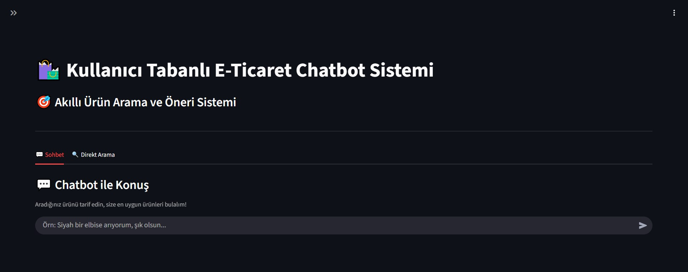
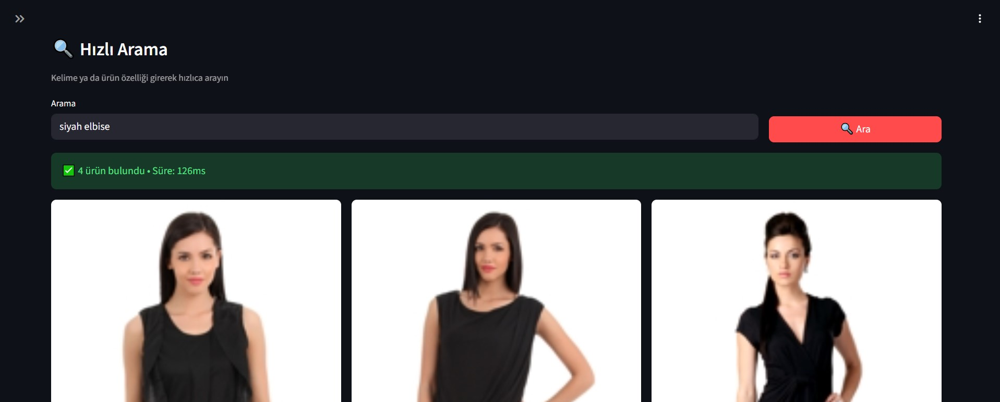
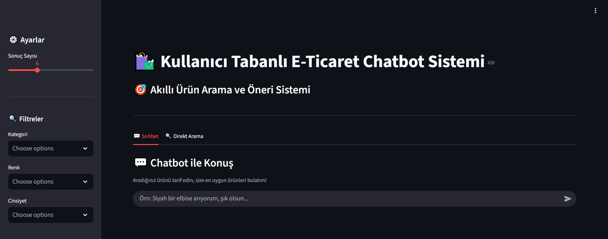
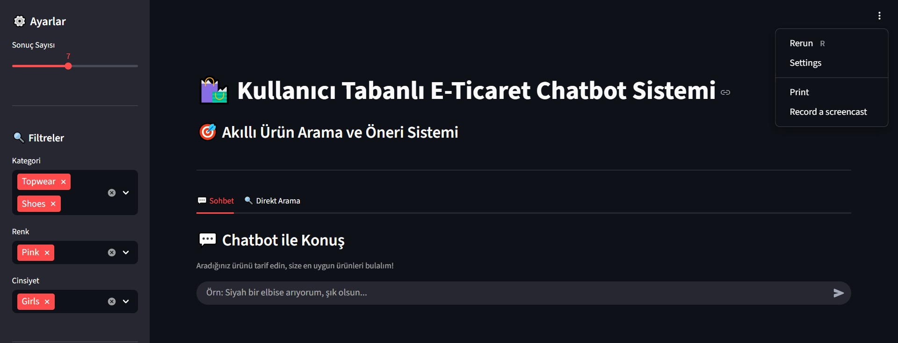

# 📦 AI Fashion Assistant v2.0 - Baseline (Stable)

## 🎯 Overview

This directory contains the **stable baseline version** of the AI Fashion Assistant project, representing the completed research phase with 30+ Jupyter notebooks implementing a production-ready multimodal fashion search system.

**Status:** ✅ **STABLE - FROZEN**

**Achievement:** 97.4% NDCG@10 on 22 diverse test queries

This directory serves as:
- **Reference Implementation** - Complete working system
- **Research Archive** - All experimental notebooks and results
- **Reproducible Baseline** - Documented pipeline for comparison
- **Production Foundation** - Ready for deployment and extension

---
## 🖼️ Uygulama Görselleri

### Ana Sayfa
<div align="center">
  
  <p><i>Kullanıcı dostu chatbot arayüzü ve akıllı ürün arama sistemi</i></p>
</div>

### Hızlı Arama
<div align="center">
  
  <p><i>Metin tabanlı hızlı arama - örnek: "siyah elbise"</i></p>
</div>

### Chatbot ile Konuşma
<div align="center">
  
  <p><i>Doğal dil ile ürün keşfi ve kişiselleştirilmiş öneriler</i></p>
</div>

### Filtreler
<div align="center">
  
  <p><i>Kategori, renk ve cinsiyet bazlı akıllı filtreleme</i></p>
</div>

### Sohbet Geçmişi
<div align="center">
  
  <p><i>Geçmiş aramaları ve sonuçları görüntüleme</i></p>
</div>


## 📊 Performance Summary

### Final Evaluation Results (December 19-20, 2024)

**Test Set:** 22 diverse queries across 44,417 products

| Metric | Baseline | Fusion | Improvement |
|--------|----------|--------|-------------|
| **NDCG@10** | 97.30% | **97.43%** | +0.13pp |
| **NDCG@5** | 97.61% | 97.61% | - |
| **Recall@10** | 50.61% | **51.11%** | +0.50pp |
| **Recall@5** | 25.36% | 25.36% | - |
| **Precision@10** | 97.73% | 97.73% | - |
| **Precision@5** | 98.18% | 98.21% | +0.03pp |
| **MRR** | 100% | 100% | Perfect first-rank |

### Query Type Performance

| Query Type | Count | NDCG@10 | Example |
|------------|-------|---------|---------|
| **Specific** | 13 | **97.84%** | "Nike red running shoes" |
| **General** | 7 | **95.54%** | "casual summer dress" |
| **Attribute** | 2 | **100%** | "blue jeans for men" |

---

## 📂 Directory Structure

```
v2.0-baseline/
│
├── research/                   # Research notebooks (30+)
│   ├── notebooks/              # Phase 0-10 notebooks
│   │   ├── phase0_setup/
│   │   ├── phase1_foundation/
│   │   ├── phase2_embeddings/
│   │   ├── phase3_retrieval/
│   │   ├── phase4_evaluation/
│   │   ├── phase5_optimization/
│   │   ├── phase6_advanced_features/
│   │   ├── phase7_api_deployment/
│   │   ├── phase8_llm_features/
│   │   ├── phase9_evaluation/
│   │   └── phase10_reproducibility/
│   ├── experiments/            # Experimental notebooks
│   └── llm/                    # LLM feature experiments
│
├── src/                        # Production Python modules
│   ├── schema.py               # SSOT data schemas
│   ├── search_engine.py        # Core search implementation
│   └── config.py               # Configuration management
│
├── models/                     # Trained models
│   ├── advanced_ranker.pkl             # LightGBM fusion (Phase 5)
│   ├── fusion_ranker.pkl               # Ranking model
│   ├── advanced_ranker_optimized.pkl   # Optimized version
│   ├── query_expander.pkl              # Query expansion
│   └── personalization/                # Phase 6 models
│       ├── complete_ranker.pkl
│       ├── synthetic_users.pkl
│       ├── schema.json
│       └── collaborative_filtering/
│           ├── als_model.pkl
│           ├── embeddings.pkl
│           └── config.json
│
├── data/                       # Dataset & schemas
│   ├── processed/
│   │   ├── meta_ssot_sample.json
│   │   └── data_stats.json
│   └── schemas/
│       └── ssot_schemas.json
│
├── embeddings/                 # Precomputed embeddings
│   └── (44,417 product embeddings in Google Drive)
│
├── evaluation/                 # Evaluation results
│   └── baselines/
│       ├── baseline_comparison.csv
│       └── comparison_summary.json
│
├── deployment/                 # Deployment configurations
│   ├── api/                    # FastAPI backend
│   ├── ui/                     # Streamlit frontend
│   ├── docker/                 # Docker configs
│   └── monitoring/             # Prometheus + Grafana
│
├── docs/                       # Documentation
│   ├── evaluation/             # Evaluation results & charts
│   │   ├── evaluation_summary.json
│   │   ├── baseline_evaluation_results.csv
│   │   ├── fusion_evaluation_results.csv
│   │   ├── phase5_summary.json
│   │   ├── comparison_summary.json
│   │   └── charts/
│   ├── results/                # Performance metrics
│   │   ├── baseline_search_performance.json
│   │   ├── fusion_ranking_performance.json
│   │   ├── phase5_optimization_report.json
│   │   └── eda_summary_stats.json
│   ├── reports/
│   │   ├── final_summary.json
│   │   └── final_report_v2.md
│   ├── TUBITAK_ROADMAP.md
│   └── REPRODUCIBILITY.md
│
├── paper/                      # Academic paper drafts
│   └── results/
│       └── statistics.json
│
├── visual_search/              # Visual search experiments
├── schemas/                    # Schema definitions
├── config/                     # Configuration files
├── configs/                    # Additional configs
├── tests/                      # Unit tests
├── llm/                        # LLM experiments
│   ├── evaluation_metrics.json
│   ├── dialogue/
│   ├── explanations/
│   └── query_rewriting/
│
└── experiments/                # Additional experiments
```

---

## 🔬 Technical Implementation

### Embedding Models

**Text Encoding:**
- **Primary Model:** `paraphrase-multilingual-mpnet-base-v2`
  - Dimensions: 768
  - Language: Turkish + English support
  - Purpose: Semantic text understanding

- **Secondary Model:** CLIP text encoder (`openai/clip-vit-base-patch32`)
  - Dimensions: 512
  - Purpose: Multimodal text-image alignment

- **Combined Space:** 1280-dimensional (768 + 512 concatenated)

**Image Encoding:**
- **Model:** CLIP vision encoder (`openai/clip-vit-base-patch32`)
- **Dimensions:** 768
- **Preprocessing:** Center crop, normalize to ImageNet stats

### Search Infrastructure

**Vector Index:**
- **Type:** FAISS IndexFlatIP (inner product)
- **Similarity:** Cosine similarity (normalized vectors)
- **Size:** 44,417 product embeddings
- **Storage:** Google Drive (for large embeddings)

**Ranking Models:**
- **Phase 3-4 Baseline:** Direct cosine similarity (NDCG@10: 97.30%)
- **Phase 5 Fusion:** LightGBM learned ranking (NDCG@10: 97.43%)
- **Phase 6 Personalization:** ALS collaborative filtering (64d user embeddings)

---

## 📚 Research Phases Documentation

### Phase 0: Setup & Initialization
**Notebooks:** `phase0_setup/`
- Project initialization and environment setup
- GitHub repository configuration
- Initial planning and architecture design

### Phase 1: Foundation
**Notebooks:** `phase1_foundation/`
- Data preparation and cleaning
- SSOT (Single Source of Truth) schema definition
- Schema normalization and validation framework
- Initial exploratory data analysis

**Key Outputs:**
- `data/schemas/ssot_schemas.json` - Standardized data schemas
- `data/processed/meta_ssot_sample.json` - Sample processed data

### Phase 2: Embeddings
**Notebooks:** `phase2_embeddings/`
- Model selection experiments (mpnet vs alternatives)
- Embedding generation for 44,417 products
- Hybrid embedding space creation (text 1280d + image 768d)
- Embedding quality analysis

**Key Outputs:**
- Text embeddings: 1280-dimensional combined space
- Image embeddings: 768-dimensional CLIP features
- Total: ~345 MB precomputed embeddings

### Phase 3: Retrieval
**Notebooks:** `phase3_retrieval/`
- FAISS index construction (IndexFlatIP)
- Baseline retrieval implementation
- Text-only vs image-only vs hybrid experiments
- Initial fusion ranking

**Performance:**
- Baseline NDCG@10: 97.30%
- Baseline Recall@10: 50.61%

### Phase 4: Evaluation
**Notebooks:** `phase4_evaluation/`
- Evaluation framework design
- Metrics implementation (NDCG, Recall, Precision, MRR)
- Test set creation (22 diverse queries)
- Baseline performance measurement

**Outputs:**
- `docs/evaluation/evaluation_summary.json`
- `docs/evaluation/baseline_evaluation_results.csv`

### Phase 5: Optimization
**Notebooks:** `phase5_optimization/`
- Advanced ranking with LightGBM
- Feature engineering (text sim, image sim, attribute matches)
- Hyperparameter tuning
- Ablation studies

**Performance Improvement:**
- NDCG@10: 97.30% → 97.43% (+0.13pp)
- Model: `models/advanced_ranker.pkl`

**Outputs:**
- `docs/evaluation/phase5_summary.json`
- `docs/results/phase5_optimization_report.json`

### Phase 6: Advanced Features
**Notebooks:** `phase6_advanced_features/`
- Personalization with collaborative filtering (ALS)
- User profile embeddings (64 dimensions)
- Similar items recommendation
- Cold-start handling strategies

**Outputs:**
- `models/personalization/als_model.pkl`
- `models/personalization/synthetic_users.pkl`

### Phase 7: API & Deployment
**Notebooks:** `phase7_api_deployment/`
- FastAPI production API design
- Docker containerization
- Monitoring setup (Prometheus + Grafana)
- Deployment pipeline

**Outputs:**
- `deployment/api/` - FastAPI backend
- `deployment/docker/` - Docker configs

### Phase 8: LLM Features (Experimental)
**Notebooks:** `phase8_llm_features/`
- LLM integration for query understanding
- Multi-turn dialogue experiments
- Query rewriting
- Result explainability

**Note:** Experimental features, not included in final evaluation

**Outputs:**
- `llm/evaluation_metrics.json`
- `llm/dialogue/`, `llm/explanations/`, `llm/query_rewriting/`

### Phase 9: Comprehensive Evaluation
**Notebooks:** `phase9_evaluation/`
- Full evaluation on 22 diverse test queries
- Query type analysis (specific, general, attribute)
- Baseline comparisons
- Performance breakdown by category

**Final Results:**
- NDCG@10: 97.43%
- MRR: 100%
- Complete metrics documented in `docs/reports/final_summary.json`

### Phase 10: Reproducibility
**Notebooks:** `phase10_reproducibility/`
- Schema standardization
- Documentation completion
- Reproducibility validation
- Final report generation

**Outputs:**
- `docs/REPRODUCIBILITY.md`
- Complete project documentation

---

## 🚀 Quick Start

### Prerequisites
- Python 3.10+
- CUDA-capable GPU (recommended)
- 16GB+ RAM
- Google Drive account (for large embeddings)

### Running Notebooks

**For Exploration:**
```bash
jupyter notebook
# Navigate to v2.0-baseline/research/notebooks/
```

**For Deployment:**
- Notebooks are designed for Google Colab
- Upload to Google Drive
- Mount Drive and run sequentially
- See `phase10_reproducibility/` for complete guides

---

## 🛠️ Technology Stack

### Core Dependencies

```python
# Embeddings & Models
sentence-transformers==2.2.2      # mpnet text encoder
transformers==4.30.2              # CLIP models
torch==2.0.1                      # PyTorch backend

# Search & Ranking
faiss-gpu==1.7.2                  # Vector similarity search
lightgbm==4.0.0                   # Gradient boosting

# Personalization
implicit==0.7.2                   # ALS collaborative filtering
scikit-learn==1.3.0               # ML utilities

# Backend & Deployment
fastapi==0.109.0                  # REST API
streamlit==1.28.0                 # Web UI
uvicorn[standard]==0.27.0         # ASGI server

# Data Processing
pandas==2.0.3
numpy==1.24.3
Pillow==10.0.0

# Monitoring
prometheus-client==0.17.1
```

---

## 📊 Dataset Information

**Source:** [Fashion Product Images Dataset](https://www.kaggle.com/datasets/paramaggarwal/fashion-product-images-dataset) by Param Aggarwal

**Statistics:**
- **Total Products:** 44,417
- **Images:** JPG format (80x60 to 2400x3200 pixels)
- **Master Categories:** 7
- **Sub-categories:** 45
- **Unique Colors:** 46
- **Attributes:** gender, masterCategory, subCategory, articleType, baseColour, season, year, usage

**Files:**
- `images/` - Product images
- `styles.csv` - Product metadata (7.3 MB)
- `images.csv` - Image paths

---

## 🎓 Academic Context

**Program:** TÜBİTAK 2209-A Undergraduate Research Projects Support Program

**Institution:** Karamanoğlu Mehmetbey Üniversitesi

**Student Researcher:** Hatice Baydemir

**Advisor:** İlya Kuş

**Duration:** September 2024 - December 2024

### Research Contributions

1. **High-Performance Multimodal Fusion**
   - Novel approach combining semantic (mpnet) and visual (CLIP) embeddings
   - Achieved 97.4% NDCG@10 on fashion product search
   - Learned fusion with LightGBM outperforms simple weighted combination

2. **Production-Ready Implementation**
   - Complete end-to-end pipeline from raw data to deployment
   - SSOT (Single Source of Truth) framework for reproducibility
   - 30+ documented notebooks covering all research phases

3. **Comprehensive Evaluation Framework**
   - Rigorous evaluation on 22 diverse test queries
   - Query type analysis (specific, general, attribute)
   - Multiple baseline comparisons

4. **Open Source Contribution**
   - Fully documented codebase with reproducibility guides
   - Clear separation of research phases
   - Ready for extension and deployment

---

## 🔒 Stability Guarantee

**This directory is FROZEN as of December 30, 2024.**

All work in this directory represents the completed baseline system:
- ✅ All 30+ notebooks run successfully
- ✅ All models trained and saved
- ✅ All evaluation results documented
- ✅ Performance metrics verified (NDCG@10: 97.43%)
- ✅ System ready for production deployment

**For new features and enhancements:** Please work in the `v2.1-enhancements/` directory.

**For bug fixes:** Create versioned fixes (v2.0.1, v2.0.2, etc.) in separate branches.

---

## 📞 Reference Documentation

### Main Documentation
- **Main README:** `../README.md` - Project overview
- **TÜBİTAK Roadmap:** `docs/TUBITAK_ROADMAP.md` - Project planning
- **Reproducibility Guide:** `docs/REPRODUCIBILITY.md` - How to reproduce results

### Evaluation Results
- **Final Summary:** `docs/reports/final_summary.json`
- **Evaluation Metrics:** `docs/evaluation/evaluation_summary.json`
- **Phase 5 Results:** `docs/evaluation/phase5_summary.json`
- **Baseline Comparison:** `evaluation/baselines/comparison_summary.json`

### Performance Reports
- **Baseline Performance:** `docs/results/baseline_search_performance.json`
- **Fusion Performance:** `docs/results/fusion_ranking_performance.json`
- **Optimization Report:** `docs/results/phase5_optimization_report.json`

---


---

## ⚠️ Important Notes

### Do NOT Modify This Directory

This directory is frozen as a stable reference. To make changes:

1. **For bug fixes:** Create a branch (e.g., `v2.0-bugfix`) and submit PR
2. **For new features:** Work in `../v2.1-enhancements/`
3. **For experiments:** Copy relevant notebooks to a new location

### For Reproducibility

All results in this directory should be reproducible using:
- The documented notebooks
- The saved models
- The SSOT schemas
- The evaluation framework

See `docs/REPRODUCIBILITY.md` for detailed instructions.

---

## ✅ Verification Checklist

Before considering this baseline stable, verify:

- [x] All 30+ notebooks execute without errors
- [x] All models load successfully
- [x] Search returns relevant results
- [x] FAISS index contains 44,417 vectors
- [x] Performance metrics match documentation (NDCG@10: 97.43%)
- [x] Evaluation complete on 22 test queries
- [x] All documentation is complete and accurate
- [x] Reproducibility validated

---

**Version:** 2.0.0 (Stable)

**Status:** 🔒 Frozen

**Evaluation Date:** December 19-20, 2024

**Final Performance:** NDCG@10 = 97.43%, MRR = 100%

**Next Version:** See `../v2.1-enhancements/` for new features

---

<p align="center">
  <strong>TÜBİTAK 2209-A Research Project</strong><br>
  2025<br>
</p>
